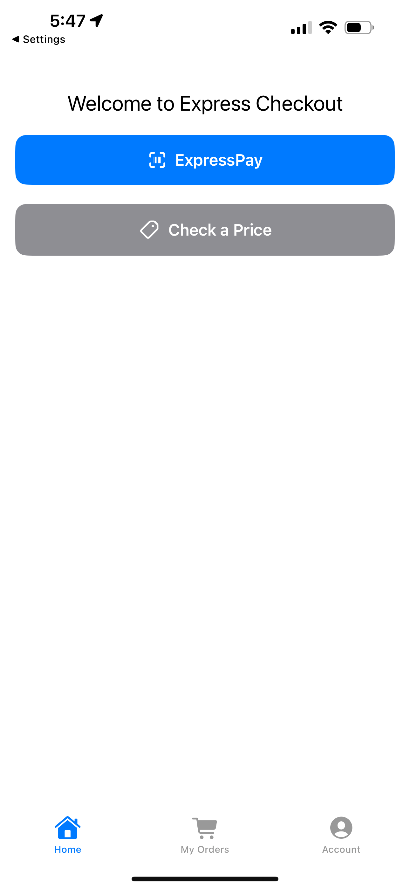
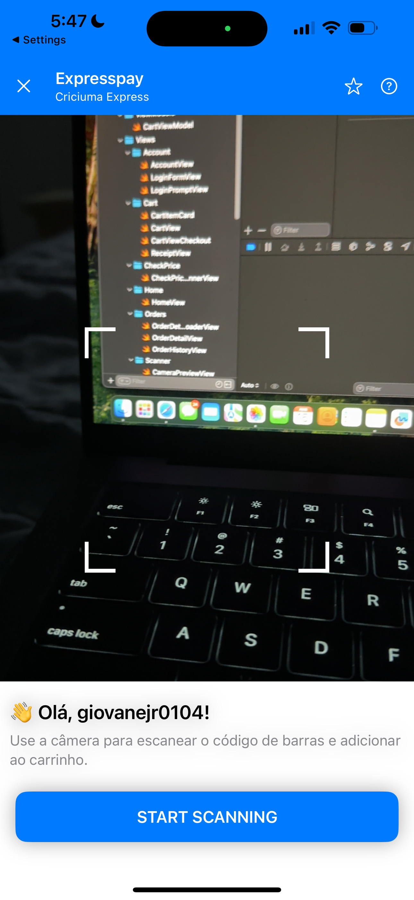
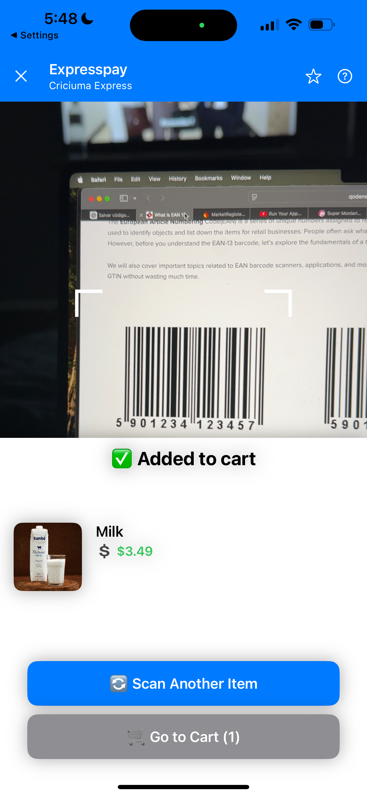
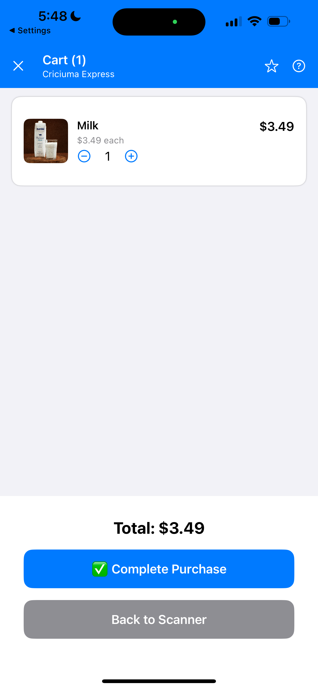
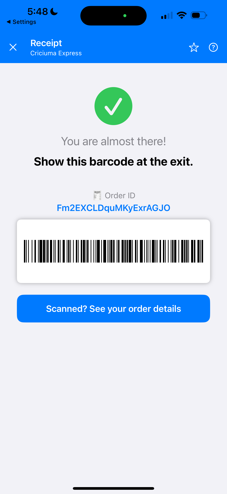
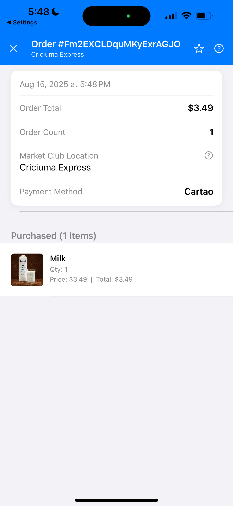

# 🛒 MarketRegisterPurchase

**MarketRegisterPurchase** is a mobile self-checkout application that transforms a smartphone into a supermarket cash register.  
Customers can scan items, add them to their cart, and complete the purchase without human interaction.  

This project is part of a complete supermarket checkout ecosystem, alongside the companion **MarketStaffApp**, 
which is used by store employees to verify purchases during the checkout process.


---

## 📸 Screenshots

<p float="left">
  
  
  
</p>

<p float="left">
  
  
  
</p>

<p float="left">
  
</p>

---

## ✨ Features
- 📷 **Barcode Scanning** — Fast and reliable scanning using AVFoundation  
- 🛒 **Real-Time Cart** — Items, quantities, and totals synced with Firebase Firestore  
- 💳 **Payment PlaceHolder** 
- 📜 **Order History** — View and retrieve past orders  
- 🏪 **Verification Flow** — Companion staff app for in-store order validation  

---

## 🛠 Tech Stack
- **Language**: Swift, SwiftUI  
- **Backend**: Firebase (Auth, Firestore, Storage)  
- **Camera**: AVFoundation (custom scanning area)  

---

## 🚀 Getting Started

1. Clone this repository:
   ```bash
   git clone https://github.com/yourusername/MarketRegisterPurchase.git
